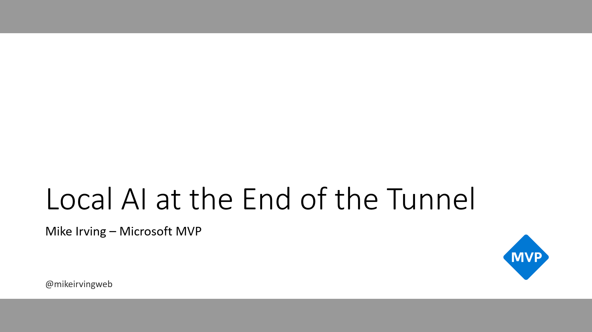

# Local AI at the End of the Tunnel
Presentation repo for my _Local AI at the End of the Tunnel_ talks

**Talk Description:**  

In this session we'll combine Local AI, .NET and Dev Tunnels!  

To begin we'll look at how easy it is to install Ollama, and download a suitable model to run locally, on our own computers.  

Turning to code, we'll then discover how quick it is to connect to Ollama via our own C# Code, using the Microsoft.Extensions.AI library. Initially interacting via our own Console App.  

Sidestepping, we'll look at an often overlooked feature: Visual Studio Dev Tunnels. We'll look at the benefits for Web Applications and Web API.  

Bringing everything together, we'll take our (minimal) Console App code, bake it into a Blazor Web Application, and expose this via a Web Tunnel. Creating a route through to our Local AI installation from any web modern browser.  

## Forthcoming Talks
⏰ To be announced  

## Past Talks  
📅 Jul 22nd 2026 - **Macc Tech** - [Website](https://www.macctech.co.uk/events/20260722) - [Slides](https://mikeirvingweb.s3.eu-west-2.amazonaws.com/local-ai-at-the-end-of-the-tunnel/presentations/2026/2026-07-22-macc-tech/Mike-Irving-Local-AI-at-the-End-of-the-Tunnel.pptx)    

---

### Code sample

🧑‍💻 [Click to go to Code Repository](code/)  

### Links from presentation

**Ollama**  
🦙 [Ollama website](https://ollama.com/)  
🔽 [Download Ollama](https://ollama.com/download)  

**.NET**  
🌐 [.NET website](https://dotnet.microsoft.com/en-us/?WT.mc_id=MVP_307078)  
🤖 [Microsoft Learn: Microsoft.Extensions.AI libraries](https://learn.microsoft.com/en-us/dotnet/ai/microsoft-extensions-ai?WT.mc_id=MVP_307078)  
🦙 [GitHub: OllamaSharp](https://github.com/awaescher/OllamaSharp)  

**Visual Studio Dev Tunnels**  
🗺️ [Microsoft Learn: Visual Studio Dev Tunnels](https://learn.microsoft.com/en-us/aspnet/core/test/dev-tunnels?WT.mc_id=MVP_307078)  
🖥️ [Microsoft Learn: Dev Tunnels command-line reference](https://learn.microsoft.com/en-us/azure/developer/dev-tunnels/cli-commands?WT.mc_id=MVP_307078)  

**Further reading**  
Presentation flow based in part on this Microsoft Learn article..  
📖 [Microsoft Learn: Chat with a local AI model using .NET](https://learn.microsoft.com/en-us/dotnet/ai/quickstarts/chat-local-model?WT.mc_id=MVP_307078)  

---
For more info, find / contact me at:  
[Bluesky](https://bsky.app/profile/mikeirvingweb.bsky.social) • [X](https://x.com/mikeirvingweb) • [LinkedIn](https://www.linkedin.com/in/mikeirving) • [GitHub](https://github.com/mikeirvingweb) • [Stack Overflow](https://stackoverflow.com/users/482901/mike-irving) • [Sessionize](https://sessionize.com/mikeirving/) • [Website & Blog](https://www.mike-irving.co.uk/)
